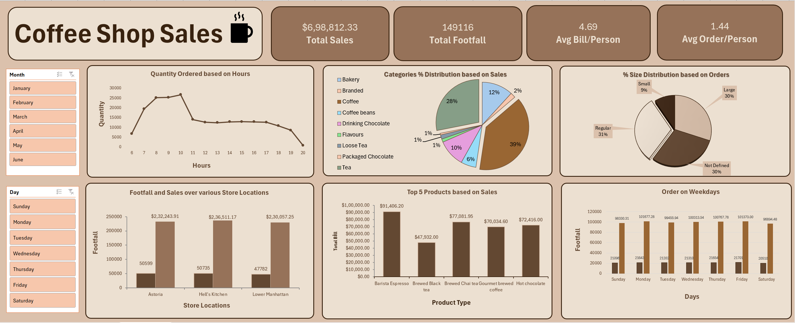

# Coffee Shop Sales Analysis (Excel)

## 📌 Project Overview
This project presents an interactive Excel dashboard built on coffee shop sales data. It focuses on analyzing key metrics and uncovering trends to support better business understanding.

## 🧠 Skills Demonstrated
- Data Cleaning
- Data Analysis
- Excel Dashboarding
- Pivot Tables & Charts
- Business Insights Generation

## 🛠️ Tools Used
- Microsoft Excel
- Pivot Tables
- Charts & Visualizations
- Slicers for interactivity

## 📈 Key Insights
- Identified peak sales hours and customer activity trends  
- Analyzed top-performing products and categories  
- Compared performance across store locations  
- Observed customer ordering behavior across weekdays
